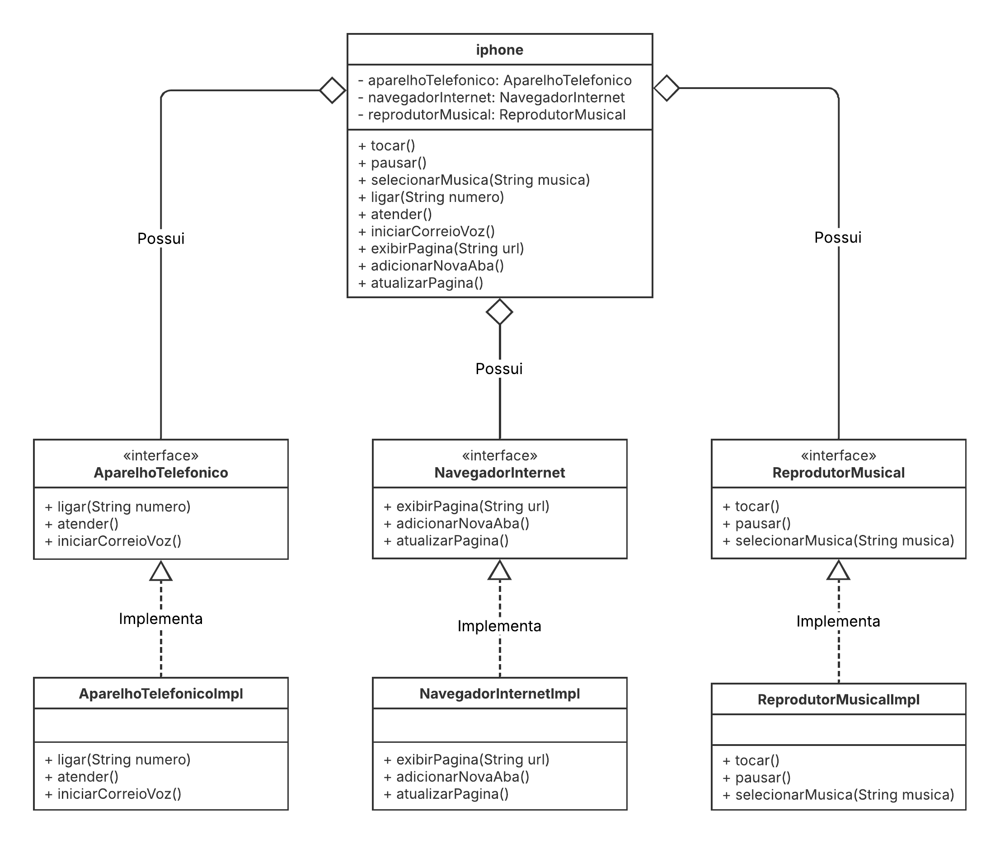

# DIO - Trilha Java - POO

## Autor do Desafio e Repositório Original
- [Gleyson Sampaio](https://github.com/glysns)
- [Desafio Diagramação de Classes do Iphone](https://github.com/digitalinnovationone/trilha-java-basico/tree/main/desafios/poo)

## Contexto
O desafio consistem em modelar o diagrama de classes `UML` e implementar o `código` baseado na especificação de um iphone, contendo funcionalidades de um navegador de internet, reprodutor musical e telefone.

O aparelho deve ser representado contendo as seguintes funcionalidades:

- `Reprodutor Musical`: tocar, pausar, selecionarMusica
- `Aparelho Telefônico`: ligar, atender, iniciarCorreioVoz
- `Navegador`: exibirPagina, adicionarNovaAba, atualizarPagina

## Diagrama de classes UML

        

